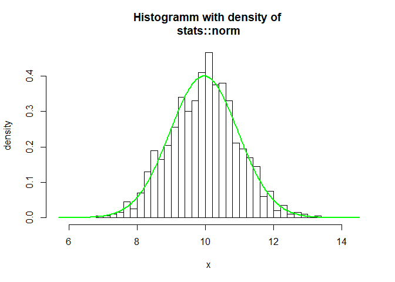
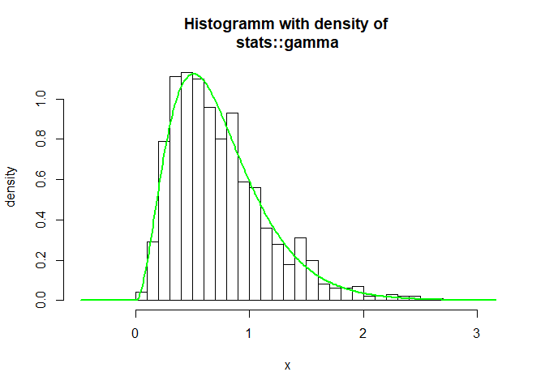
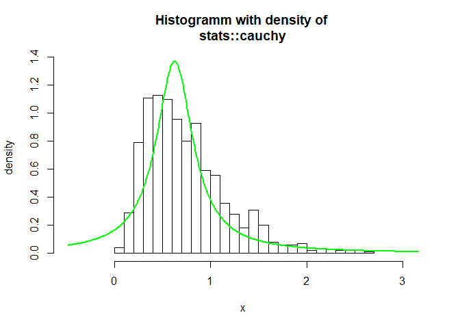

DistributionFitR
================

<!-- badges: start -->

[](https://cran.r-project.org/package=dplyr)
<!-- badges: end --> \#\# Overview

DistributionFitR is an **autopilote**, which fits the **best
distribution** in a set of distributions by maximizing the likelihood
(MLE).

Parametric densities (or count densities) will be fitted to user-given
**univariate** data via **maximum likelihood**. The user more or less
only enters the data. The program automatically searches for
**parametric distributions** and **parameters** thereof that best
describe the data. It then returns the ten **best parameter families
including the fitted parameters**.

DistributionFitR comes in with a standard search list of **408
parametric distribution families** as given by R-packages on CRAN. The
families can be adapted and increased to own packackages for special
purposes.

Installation
------------

The **easiest way** to get DistribtionFitR is to install via CRAN

``` r
install.packages("DistributionFitR")
```

To get a bug fix or to use a feature from the development version, you
can install the development version of DistributionFitR from GitHub.

``` r
# install.packages("devtools")
devtools::install_github("YCartes/DistributionFitR")
```

Usage
-----

``` r
library(DistributionFitR)
x <- rnorm(n = 1000, mean = 10, sd = 1)
r <- globalfit(x, packages = NULL, verbose = TRUE)

summary(r, n = 10)
```

    ## 
    ## Call: 
    ##  globalfit(data = x, verbose = TRUE, packages = NULL) 
    ## 
    ## 1000 data points entered. Distributions were fitted via MLE estimation. 
    ## Assumption: Data was generated from a continuous distribution. 
    ##                 
    ## Best fits sorted by BIC :
    ## 
    ##   family  package BIC      params                                      
    ## 1 norm    stats   2848.635 mean = 9.96; sd = 0.998                     
    ## 2 t       stats   2849.134 df = 1790; ncp = 9.96                       
    ## 3 gamma   stats   2854.432 rate = 9.87; shape = 98.3                   
    ## 4 f       stats   2858.886 df1 = 37.7; df2 = 207000; ncp = 338         
    ## 5 lnorm   stats   2862.345 meanlog = 2.29; sdlog = 0.101               
    ## 6 burrXII CoSMoS  2866.156 scale = 8.41; shape1 = 14.6; shape2 = 0.0361
    ## 7 logis   stats   2869.125 location = 9.97; scale = 0.571              
    ## 8 weibull stats   2928.763 scale = 10.4; shape = 10.6

``` r
hist(r)
```



``` r
r <- globalfit(rgamma(n = 1000, shape = 3, rate = 4))
summary(r, ic = "BIC")
```

    ## 
    ## Call: 
    ##  globalfit(data = rgamma(n = 1000, shape = 3, rate = 4)) 
    ## 
    ## 1000 data points entered. Distributions were fitted via MLE estimation. 
    ## Assumption: Data was generated from a continuous distribution. 
    ##                 
    ## Best fits sorted by BIC :
    ## 
    ##    family  package BIC       params                            
    ## 1  gamma   stats    851.6692 rate = 4.37; shape = 3.23         
    ## 2  lnorm   stats    883.0390 meanlog = -0.466; sdlog = 0.595   
    ## 3  weibull stats    894.2520 scale = 0.836; shape = 1.88       
    ## 4  logis   stats   1063.5151 location = 0.696; scale = 0.229   
    ## 5  f       stats   1098.8196 df1 = 5.2; df2 = 8250; ncp = 1e-10
    ## 6  norm    stats   1102.0415 mean = 0.739; sd = 0.417          
    ## 7  cauchy  stats   1330.3300 location = 0.626; scale = 0.232   
    ## 8  exp     stats   1401.5268 rate = 1.35                       
    ## 9  chisq   stats   1964.0987 ncp = 1e-10; df = 1.44            
    ## 10 t       stats   2028.8923 df = 229; ncp = 0.739

``` r
summary(r, ic = "AICc")
```

    ## 
    ## Call: 
    ##  globalfit(data = rgamma(n = 1000, shape = 3, rate = 4)) 
    ## 
    ## 1000 data points entered. Distributions were fitted via MLE estimation. 
    ## Assumption: Data was generated from a continuous distribution. 
    ##                 
    ## Best fits sorted by AICc :
    ## 
    ##    family  package AICc      params                            
    ## 1  gamma   stats    841.8657 rate = 4.37; shape = 3.23         
    ## 2  lnorm   stats    873.2355 meanlog = -0.466; sdlog = 0.595   
    ## 3  weibull stats    884.4486 scale = 0.836; shape = 1.88       
    ## 4  logis   stats   1053.7116 location = 0.696; scale = 0.229   
    ## 5  f       stats   1084.1205 df1 = 5.2; df2 = 8250; ncp = 1e-10
    ## 6  norm    stats   1092.2380 mean = 0.739; sd = 0.417          
    ## 7  cauchy  stats   1320.5266 location = 0.626; scale = 0.232   
    ## 8  exp     stats   1396.6230 rate = 1.35                       
    ## 9  chisq   stats   1954.2952 ncp = 1e-10; df = 1.44            
    ## 10 t       stats   2019.0888 df = 229; ncp = 0.739

``` r
summary(r, ic = "BIC", n = 7)
```

    ## 
    ## Call: 
    ##  globalfit(data = rgamma(n = 1000, shape = 3, rate = 4)) 
    ## 
    ## 1000 data points entered. Distributions were fitted via MLE estimation. 
    ## Assumption: Data was generated from a continuous distribution. 
    ##                 
    ## Best fits sorted by BIC :
    ## 
    ##   family  package BIC       params                            
    ## 1 gamma   stats    851.6692 rate = 4.37; shape = 3.23         
    ## 2 lnorm   stats    883.0390 meanlog = -0.466; sdlog = 0.595   
    ## 3 weibull stats    894.2520 scale = 0.836; shape = 1.88       
    ## 4 logis   stats   1063.5151 location = 0.696; scale = 0.229   
    ## 5 f       stats   1098.8196 df1 = 5.2; df2 = 8250; ncp = 1e-10
    ## 6 norm    stats   1102.0415 mean = 0.739; sd = 0.417          
    ## 7 cauchy  stats   1330.3300 location = 0.626; scale = 0.232

``` r
hist(r, ic = "BIC")
```



``` r
hist(r, ic = "BIC", which = 7)
```



``` r
AIC(r, n = 2)
```

    ## stats::gamma stats::lnorm 
    ##     841.8537     873.2235

``` r
BIC(r)
```

    ##   stats::gamma   stats::lnorm stats::weibull   stats::logis       stats::f 
    ##       851.6692       883.0390       894.2520      1063.5151      1098.8196 
    ##    stats::norm  stats::cauchy     stats::exp   stats::chisq       stats::t 
    ##      1102.0415      1330.3300      1401.5268      1964.0987      2028.8923

Contribute
----------
