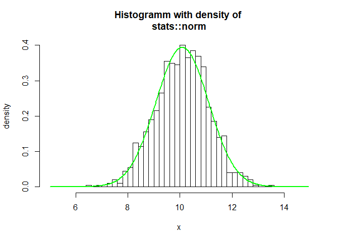
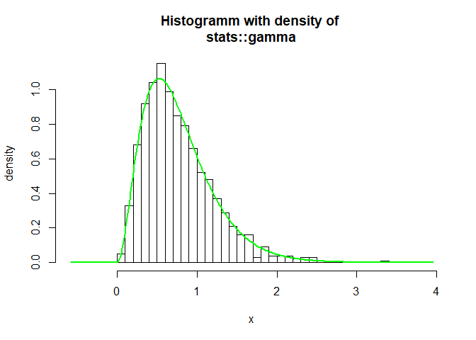
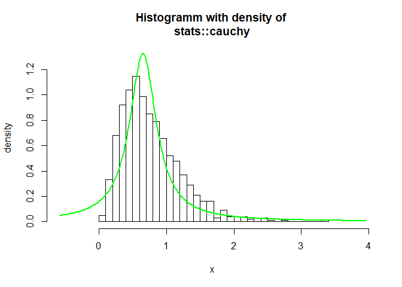

DistributionFitR
================

<!-- badges: start -->

<!-- badges: end -->

Overview
--------

DistributionFitR is an **autopilot**, which fits the **best
distribution** in a set of distributions by maximizing the likelihood
(MLE).

Parametric densities (or count densities) will be fitted to user-given
**univariate** data via **maximum likelihood**. The user more or less
only enters the data. The program automatically searches for
**parametric distributions** and **parameters** thereof that best
describe the data. It then returns the ten **best parameter families
including the fitted parameters**.

DistributionFitR comes in with a standard search list of **408
parametric distribution families** as given by R-packages on CRAN. The
families can be adapted and increased to own packackages for special
purposes.

Installation
------------

The **easiest way** to get DistribtionFitR is to install via CRAN

    install.packages("DistributionFitR")

To get a bug fix or to use a feature from the development version, you
can install the development version of DistributionFitR from GitHub.

    # install.packages("devtools")
    devtools::install_github("YCartes/DistributionFitR")

Usage
-----

    library(DistributionFitR)
    x <- rnorm(n = 1000, mean = 10, sd = 1)
    r <- globalfit(x, packages = NULL, verbose = TRUE)

    summary(r, n = 10)

    ## 
    ## Call: 
    ##  globalfit(data = x, verbose = TRUE, packages = NULL) 
    ## 
    ## 1000 data points entered. Distributions were fitted via MLE estimation. 
    ## Assumption: Data was generated from a continuous distribution. 
    ##                 
    ## Best fits sorted by BIC :
    ## 
    ##   family  package BIC      params                                      
    ## 1 norm    stats   2876.032 mean = 10.1; sd = 1.01                      
    ## 2 t       stats   2876.456 df = 2010; ncp = 10.1                       
    ## 3 gamma   stats   2888.119 rate = 9.66; shape = 97.5                   
    ## 4 burrXII CoSMoS  2890.807 scale = 8.52; shape1 = 14.1; shape2 = 0.0312
    ## 5 f       stats   2891.068 df1 = 37; df2 = 601000; ncp = 336           
    ## 6 logis   stats   2897.697 location = 10.1; scale = 0.58               
    ## 7 lnorm   stats   2899.409 meanlog = 2.31; sdlog = 0.102               
    ## 8 weibull stats   2937.380 scale = 10.5; shape = 10.7

    hist(r)

<!-- -->

    r <- globalfit(rgamma(n = 1000, shape = 3, rate = 4))
    summary(r, ic = "BIC")

    ## 
    ## Call: 
    ##  globalfit(data = rgamma(n = 1000, shape = 3, rate = 4)) 
    ## 
    ## 1000 data points entered. Distributions were fitted via MLE estimation. 
    ## Assumption: Data was generated from a continuous distribution. 
    ##                 
    ## Best fits sorted by BIC :
    ## 
    ##    family  package BIC       params                               
    ## 1  gamma   stats    966.7681 rate = 4.04; shape = 3.13            
    ## 2  lnorm   stats   1000.8849 meanlog = -0.425; sdlog = 0.606      
    ## 3  weibull stats   1009.7714 scale = 0.874; shape = 1.85          
    ## 4  f       stats   1149.0269 df1 = 5.34; df2 = 465000; ncp = 1e-10
    ## 5  logis   stats   1172.9314 location = 0.728; scale = 0.241      
    ## 6  norm    stats   1231.2078 mean = 0.773; sd = 0.445             
    ## 7  cauchy  stats   1422.0585 location = 0.652; scale = 0.24       
    ## 8  exp     stats   1492.8814 rate = 1.29                          
    ## 9  chisq   stats   2020.3723 ncp = 1e-10; df = 1.47               
    ## 10 t       stats   2052.9632 df = 216; ncp = 0.773

    summary(r, ic = "AICc")

    ## 
    ## Call: 
    ##  globalfit(data = rgamma(n = 1000, shape = 3, rate = 4)) 
    ## 
    ## 1000 data points entered. Distributions were fitted via MLE estimation. 
    ## Assumption: Data was generated from a continuous distribution. 
    ##                 
    ## Best fits sorted by AICc :
    ## 
    ##    family  package AICc      params                               
    ## 1  gamma   stats    956.9647 rate = 4.04; shape = 3.13            
    ## 2  lnorm   stats    991.0815 meanlog = -0.425; sdlog = 0.606      
    ## 3  weibull stats    999.9679 scale = 0.874; shape = 1.85          
    ## 4  f       stats   1134.3277 df1 = 5.34; df2 = 465000; ncp = 1e-10
    ## 5  logis   stats   1163.1279 location = 0.728; scale = 0.241      
    ## 6  norm    stats   1221.4043 mean = 0.773; sd = 0.445             
    ## 7  cauchy  stats   1412.2551 location = 0.652; scale = 0.24       
    ## 8  exp     stats   1487.9777 rate = 1.29                          
    ## 9  chisq   stats   2010.5688 ncp = 1e-10; df = 1.47               
    ## 10 t       stats   2043.1597 df = 216; ncp = 0.773

    summary(r, ic = "BIC", n = 7)

    ## 
    ## Call: 
    ##  globalfit(data = rgamma(n = 1000, shape = 3, rate = 4)) 
    ## 
    ## 1000 data points entered. Distributions were fitted via MLE estimation. 
    ## Assumption: Data was generated from a continuous distribution. 
    ##                 
    ## Best fits sorted by BIC :
    ## 
    ##   family  package BIC       params                               
    ## 1 gamma   stats    966.7681 rate = 4.04; shape = 3.13            
    ## 2 lnorm   stats   1000.8849 meanlog = -0.425; sdlog = 0.606      
    ## 3 weibull stats   1009.7714 scale = 0.874; shape = 1.85          
    ## 4 f       stats   1149.0269 df1 = 5.34; df2 = 465000; ncp = 1e-10
    ## 5 logis   stats   1172.9314 location = 0.728; scale = 0.241      
    ## 6 norm    stats   1231.2078 mean = 0.773; sd = 0.445             
    ## 7 cauchy  stats   1422.0585 location = 0.652; scale = 0.24

    hist(r, ic = "BIC")

<!-- -->

    hist(r, ic = "BIC", which = 7)

<!-- -->

    AIC(r, n = 2)

    ## stats::gamma stats::lnorm 
    ##     956.9526     991.0694

    BIC(r)

    ##   stats::gamma   stats::lnorm stats::weibull       stats::f   stats::logis 
    ##       966.7681      1000.8849      1009.7714      1149.0269      1172.9314 
    ##    stats::norm  stats::cauchy     stats::exp   stats::chisq       stats::t 
    ##      1231.2078      1422.0585      1492.8814      2020.3723      2052.9632

Contribute
----------

Read more [here](./private/how-to-contribute.md).
